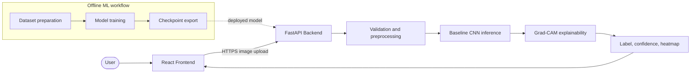

# FaceGuard

FaceGuard is a privacy-preserving web application for detecting whether a profile photo is likely to be a real human face image or an AI-generated synthetic face. The project combines image classification, explainability, and careful privacy handling so users can get an advisory result without handing over long-term control of their uploaded images.

## Current Status

This repository is moving from planning into implementation.

- The repository currently contains proposal-era planning artefacts and diagrams.
- The Markdown documentation in this repository now defines the implementation-ready version of the project.
- The PDFs in `docs/` and `diagrams/` should be treated as historical planning references, not the final source of truth.

## Problem Statement

AI-generated profile photos can be used for catfishing, impersonation, fraud, and social engineering. Existing detectors are often difficult for non-technical users to understand, and many tools create privacy concerns by storing uploaded images or providing opaque results.

FaceGuard aims to address that gap with:

- A simple web interface for image upload and result display.
- A deepfake profile-photo classifier focused on static face images.
- Explainability output such as Grad-CAM heatmaps.
- A privacy-first inference flow that does not retain uploaded images in persistent storage for the MVP.

## Recommended MVP

The first production-worthy milestone should include only the capabilities the team can build, evaluate, and explain well:

- Upload a single image in supported formats.
- Validate file type and size.
- Detect whether the image contains one clear face suitable for analysis.
- Run model inference and return a label plus calibrated confidence.
- Show an explainability heatmap.
- Delete uploaded image data after inference completes.
- Show clear status, error, and disclaimer messages.
- Deploy a demo frontend and backend.

## Out Of Scope For MVP

- Persistent storage of uploaded images.
- Video deepfake detection.
- Face recognition, identity matching, or biometric verification.
- Large-scale production concurrency and uptime guarantees.
- Automated feedback pipelines that store flagged user uploads.

NOTE: Feasibility issue: original planning includes authentication/login in requirements, which adds delivery and security overhead for early MVP.

## Documentation Map

These files are now the team-facing source of truth:

| File | Purpose |
| --- | --- |
| [README.md](./README.md) | Project overview, status, and document index |
| [architecture.md](./architecture.md) | Recommended system architecture and deployment decisions |
| [readme/product-spec.md](./readme/product-spec.md) | Product scope, refined requirements, and MVP acceptance criteria |
| [readme/data-and-model-plan.md](./readme/data-and-model-plan.md) | Dataset, training, evaluation, and explainability plan |
| [readme/development-roadmap.md](./readme/development-roadmap.md) | Step-by-step implementation plan and milestone sequence |
| [readme/team-workflow.md](./readme/team-workflow.md) | Collaboration rules, branching, testing, and Definition of Done |
| [readme/planning-review.md](./readme/planning-review.md) | Review of the original planning and recommended corrections |

## High-Level Technical Direction

- Frontend: React with a simple static deployment target.
- Backend API: FastAPI for upload validation, preprocessing, inference, and explainability.
- Model: ResNet-based MVP with planned progression to hybrid CNN-ViT.
- Explainability: Grad-CAM or a close equivalent supported by the chosen model.
- Privacy: In-memory or short-lived temporary processing only for MVP.
- Deployment: Netlify is planned as the hosting platform for the web app.

NOTE: Feasibility issue: Netlify does not by itself provide persistent FastAPI backend hosting; backend deployment still needs a separate runtime target.

## Visual Overview



Detailed diagrams are embedded in [architecture.md](./architecture.md), [readme/data-and-model-plan.md](./readme/data-and-model-plan.md), and [readme/development-roadmap.md](./readme/development-roadmap.md).

## Proposed Repository Shape

The codebase does not exist yet, but this is the recommended structure to create first:

```text
frontend/                React application
backend/                 FastAPI application
model/                   training, evaluation, and inference code
tests/                   automated tests
docs/                    team-facing documentation
data/                    local-only data instructions, not raw datasets in git
scripts/                 helper scripts for setup, evaluation, and deployment
```

Current repository note: the Markdown planning and implementation documents currently live under `readme/`. When the application code is scaffolded, the team can consolidate them under `docs/` if desired.

## Immediate Next Actions

1. Create the initial repository structure for `frontend/`, `backend/`, `model/`, `tests/`, and `scripts/`.
2. Convert the refined requirements in `readme/product-spec.md` into a backlog.
3. Build and evaluate a baseline model offline before designing the production API around it.
4. Implement the backend inference contract before building the full frontend.
5. Deploy the frontend and backend separately only after the end-to-end local flow works.

## Historical Planning Artefacts

The following files are still useful for background context:

- `docs/final-proposal-doc.pdf`
- `docs/final-proposal-presentation.pdf`
- `docs/requirement-traceability-matrix.pdf`
- `diagrams/SystemArchitecture.pdf`
- `diagrams/DataFlowLevel0.pdf`
- `diagrams/DataFlowLevel1.pdf`
- `diagrams/Use_Cases.pdf`

Use them for traceability, not as the latest implementation plan.
