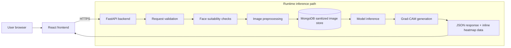
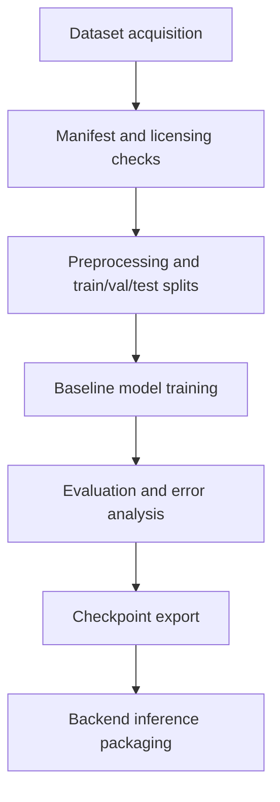
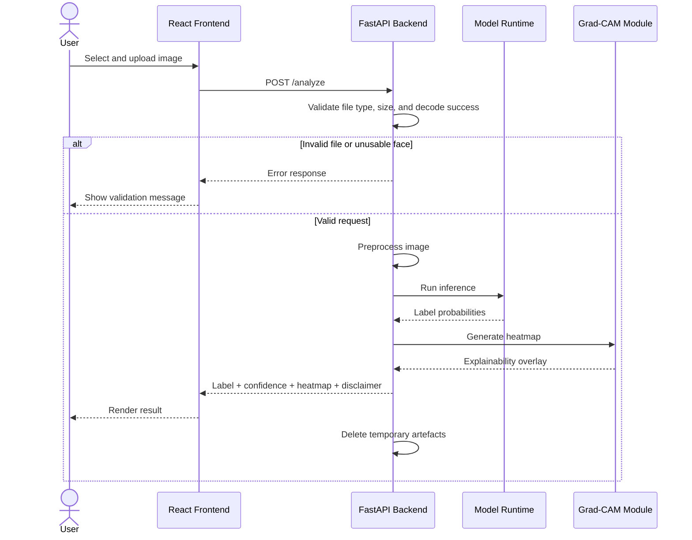
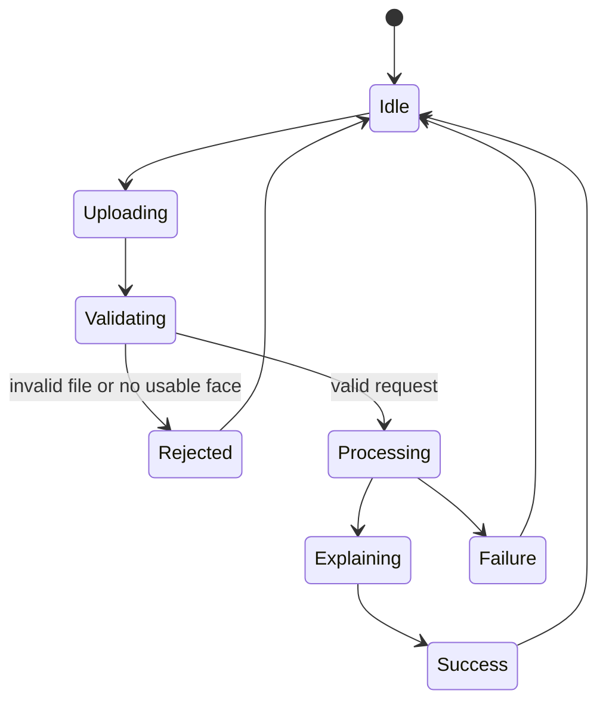

# FaceGuard Architecture

This document replaces the proposal-era architecture as the implementation baseline.

## 1. Architecture Goals

The architecture must satisfy four constraints at the same time:

1. Privacy-first handling of uploaded images.
2. Feasible delivery by a small academic team within one development cycle.
3. Clear explainability for user trust and project defensibility.
4. Reproducible model training and deployable end-to-end demos.

## 2. Planned System Boundary

FaceGuard is planned as two runtime applications plus one offline machine-learning workflow:

- A static frontend application.
- A backend inference API.
- A separate offline training and evaluation pipeline.

Training is not a runtime component. It should not be modeled as part of the live request path.

## 3. Planned Runtime Architecture



Planned architecture includes sanitized image handling with MongoDB in the runtime path.

NOTE: This may conflict with the privacy-preserving and no-retention requirement unless retention policy and deletion guarantees are explicitly enforced.

## 4. Offline ML Architecture



This workflow can run locally, on university GPU infrastructure, or on a cloud notebook environment. It should remain decoupled from the production API.

## 5. Runtime Components

| Component | Responsibility | Notes |
| --- | --- | --- |
| Frontend | Upload UI, progress state, result rendering, disclaimer messaging | Static site |
| Backend API | Accept upload, validate, preprocess, run inference, return result | Main system boundary |
| Model runtime | Load trained checkpoint and generate prediction | Packaged inside backend service for MVP |
| Explainability module | Produce Grad-CAM heatmap or equivalent visual explanation | Must match chosen model architecture |
| Logging | Record non-sensitive operational metadata only | No image payload retention |

## 6. Planned Design Decisions

### 6.1 Frontend

- Use React with a lightweight component structure.
- Keep the frontend stateless for the MVP.
- Do not build login, session history, or user-specific dashboards unless those features become mandatory later.

### 6.2 Backend

- Use FastAPI as the single HTTP API.
- Keep preprocessing inside the backend process unless a real need appears for separation.
- Return a compact result contract:

```json
{
  "label": "ai_generated",
  "confidence": 0.87,
  "heatmap": "base64-encoded-overlay",
  "disclaimer": "Advisory result only. Not identity verification."
}
```

The exact response shape can change, but the MVP should remain simple.

### 6.3 Persistence

Planned design stores sanitized uploaded images in MongoDB as part of processing.

NOTE: Feasibility issue: this can contradict the privacy/no-retention objective unless strict auto-delete and retention controls are implemented and verified.

### 6.4 Authentication

Planned design includes authentication and login for registered users.

NOTE: Feasibility issue: authentication adds significant implementation and security overhead, and may not directly improve core detection capability for early MVP delivery.

### 6.5 Model Choice

Planned model progression starts with ResNet MVP and then advances to hybrid CNN-ViT for improved robustness and generalization.

NOTE: Feasibility issue: moving to hybrid CNN-ViT too early can increase compute and integration risk before the baseline is validated.

### 6.6 Explainability

Use Grad-CAM as the primary user-facing explanation for the MVP.

It is appropriate because:

- the team already planned for it
- users can interpret heatmaps more easily than SHAP-style feature outputs
- it works well with CNN baselines
- it supports the project's transparency objective

### 6.7 Deployment

Planned deployment uses Netlify as the primary web hosting platform.

NOTE: Feasibility issue: Netlify alone does not host a persistent FastAPI inference backend; a separate backend hosting target is still required.

## 7. Runtime Data Flow

### 7.1 Sequence Diagram



### 7.2 Request State Diagram



1. User uploads an image from the browser.
2. Frontend validates basic file constraints before sending.
3. Frontend sends the file to the backend over HTTPS.
4. Backend validates MIME type, file size, and decode success.
5. Backend checks face suitability rules.
6. Backend preprocesses the image tensor.
7. Backend runs model inference.
8. Backend generates a Grad-CAM heatmap.
9. Backend returns label, confidence, heatmap, and disclaimer.
10. Backend deletes temporary artefacts.

## 8. Privacy And Security Rules

These should be treated as hard architectural rules:

- Uploaded images are not retained after inference in the MVP.
- Raw image contents must not appear in logs.
- Limit accepted file types and file sizes.
- Reject malformed files and oversized uploads early.
- Return advisory results only, not identity claims.
- Enforce HTTPS in deployed environments.
- Keep secrets outside the repository.

## 9. Planning Feasibility Notes

| Planned item | NOTE |
| --- | --- |
| MongoDB stores sanitized uploads | Feasibility issue: can conflict with no-retention privacy claims unless strict deletion policy is guaranteed. |
| Netlify as web hosting | Feasibility issue: FastAPI inference backend still needs separate backend hosting. |
| Authentication/login in early scope | Feasibility issue: adds security and delivery overhead without direct impact on baseline detection. |
| ResNet to hybrid CNN-ViT progression | Feasibility issue: advancing too early to hybrid can increase risk before baseline validation. |
| Hard performance promises (for example `>= 90%` accuracy and `99%` uptime) | Feasibility issue: can be unrealistic before environment and dataset limits are validated. |
| Full tooling stack from day 1 (DVC, registries, multi-service infra) | Feasibility issue: setup complexity may delay core model and product delivery. |
| "Burner accounts" contingency | Feasibility issue: operationally and ethically unsuitable as a risk mitigation strategy. |

## 10. Suggested Future Extensions

Only add these after the MVP is stable:

- opt-in user feedback collection
- admin review dashboard
- account system
- model version comparison
- cross-dataset benchmarking
- rate limiting
- queue-based batch inference

## 11. Architecture Planning Summary

The architecture document keeps the original planning direction and now adds feasibility notes under sections that may introduce delivery or design risk.

