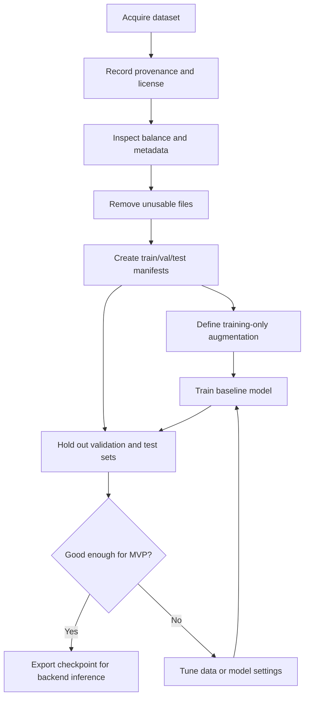
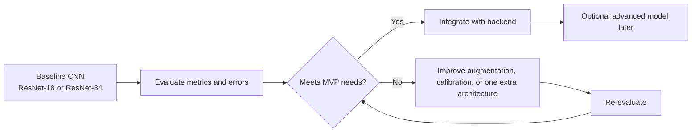

# FaceGuard Data And Model Plan

## 1. Objective

Build a reliable baseline model for detecting AI-generated profile photos from static face images, then integrate that model into a privacy-preserving web workflow.

## 2. Data Strategy

### Primary dataset

The proposal identifies `AI-Face v2` as the main dataset. That remains a reasonable primary choice if the team confirms:

- access is available
- licensing is compatible with the project
- demographic annotations are actually usable
- the dataset contains enough variation in both real and synthetic images

### Optional supplementary data

Supplementary datasets may be added only if they improve robustness or evaluation quality without breaking scope. Any addition must be documented with:

- source
- license
- image type
- known limitations

## 3. Data Governance Rules

- Do not commit raw datasets into git.
- Maintain a dataset manifest describing sources, versions, and licenses.
- Document preprocessing steps so experiments are reproducible.
- If demographic annotations are used, treat subgroup analysis as evaluation data, not as user-facing prediction labels.

## 4. Data Preparation Workflow

1. Acquire dataset and record provenance.
2. Inspect class balance and metadata availability.
3. Remove unusable files.
4. Define train, validation, and test split rules.
5. Prevent leakage across identities or generators where possible.
6. Normalize image size and color pipeline.
7. Define augmentation strategy for training only.
8. Save split manifests so experiments are repeatable.

### 4.1 Data Pipeline Diagram

## 5. Split Strategy

The team should not rely on a random split alone if generator leakage is possible.

Preferred rules:

- Keep train, validation, and test manifests under version control.
- If generator metadata exists, try to hold out some generators or generation settings.
- If identity metadata exists, avoid the same identity appearing across splits.
- If subgroup labels exist, report subgroup counts for each split.

## 6. Modeling Roadmap

### Stage 1: Baseline model

Start with one small, defensible model:

- ResNet-18 or ResNet-34
- or EfficientNet-B0/B1

Why start here:

- simpler to train
- easier to explain with Grad-CAM
- lower latency at inference time
- lower integration cost

### Stage 2: Improvement cycle

Only after the baseline is stable:

- tune augmentation and regularization
- compare one additional architecture
- improve calibration
- run subgroup evaluation

### Stage 3: Optional advanced model

Consider a hybrid CNN-ViT only if:

- the baseline clearly underperforms
- the team has enough compute
- the deployment budget can still support inference latency
- explainability remains manageable

Do not begin the project with the hybrid model.

### 6.1 Model Progression Diagram

## 7. Explainability Plan

The user-facing explainability output for MVP should be Grad-CAM or an equivalent heatmap-based method supported by the chosen baseline model.

Requirements:

- generate a stable heatmap for each successful prediction
- overlay it clearly on the original image
- explain in the UI that it highlights influential regions, not ground-truth manipulation pixels

## 8. Evaluation Plan

### Core metrics

- balanced accuracy
- precision
- recall
- F1 score
- confusion matrix
- ROC-AUC if probability output is meaningful

### Additional analysis

- calibration behavior
- false positive and false negative examples
- robustness under compression or resizing
- subgroup slices where labels exist

### Fairness position

The proposal's fairness goal is directionally correct, but fairness should be framed carefully:

- measure and report subgroup differences
- do not claim bias mitigation success without evidence
- do not set unrealistic pass/fail thresholds before seeing the data

## 9. Experiment Tracking

Keep experiment tracking simple at the start.

Minimum required tracking:

- experiment id
- dataset version or manifest hash
- model architecture
- training hyperparameters
- checkpoint name
- evaluation metrics
- notes on failures or observations

This can begin as a CSV, Markdown table, or structured JSON logs. DVC can be added later if the team has time and discipline to use it correctly.

## 10. Inference Packaging

The backend should not depend on training notebooks.

Before integration, export:

- model checkpoint
- preprocessing configuration
- class labels
- confidence calibration details if used

Wrap these in a reusable inference module so the API can call one stable entrypoint.

## 11. Deliverables

The ML stream should produce:

1. Dataset manifest and data usage notes.
2. Training script or notebook converted into reproducible script form.
3. Baseline evaluation report.
4. Inference wrapper used by the FastAPI backend.
5. Example explainability outputs.

## 12. Common Failure Modes To Watch

| Failure mode | Why it matters | Mitigation |
| --- | --- | --- |
| Split leakage | Inflates test metrics | Use explicit split manifests |
| Overfitting to generator artefacts | Weak real-world generalization | Hold out generators or styles when possible |
| Poor confidence calibration | Misleads users | Add calibration or communicate uncertainty clearly |
| Heatmap instability | Weakens trust | Validate explainability on representative samples |
| Dataset imbalance | Distorts results | Measure per-class and subgroup performance |
