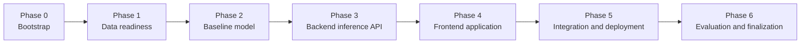
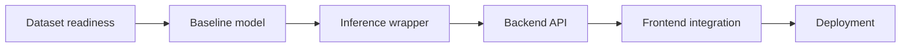
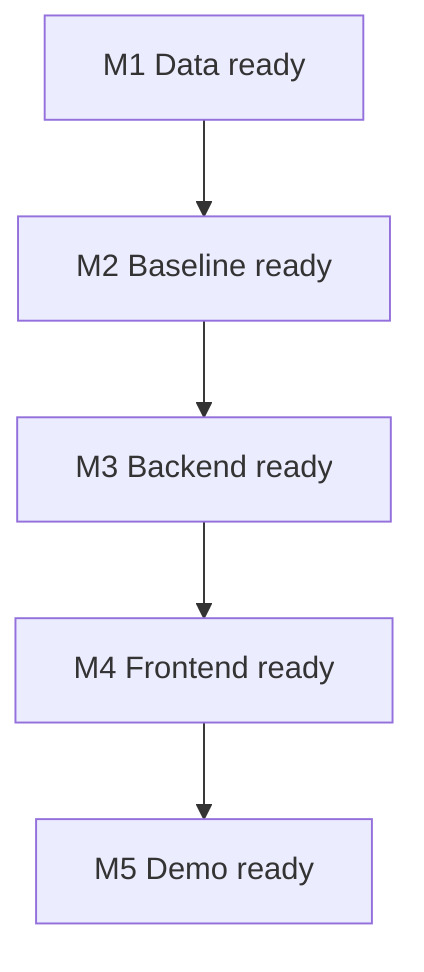

# FaceGuard Development Roadmap

This roadmap translates the planning documents into a practical build sequence.

## 1. Delivery Strategy

Build the project in vertical slices:

1. Make the model work offline.
2. Wrap the model in a backend inference API.
3. Build the frontend around a fixed API contract.
4. Add privacy hardening and deployment last, not first.

This is safer than building UI, auth, database, and infrastructure before the classifier works.

### 1.1 Roadmap Flow

## 2. Team Roles

Use the roles from the proposal as operating leads, not rigid silos.

| Team member | Lead areas |
| --- | --- |
| Er Jun Yet | Product ownership, backlog, documentation, supervisor communication |
| Tan Yan Yi | Technical lead, architecture alignment, repo standards, integration support |
| Bryan Ong Zong Sheng | ML lead, backend inference, evaluation pipeline |
| Muhammad Ali Afzal | Frontend lead, UX, QA, usability testing |

Everyone should still review, test, and understand the core system.

## 3. Phase Plan

### Phase 0: Project bootstrap

Objective: create a workable engineering base.

Tasks:

- Create `frontend/`, `backend/`, `model/`, `tests/`, and `scripts/`.
- Choose the exact frontend tooling, backend package layout, and Python version.
- Add linting, formatting, and test runners.
- Set up planned full tooling stack early: DVC, Docker packaging, model registry workflow, and CI/CD automation.
- Write the first issue backlog from this documentation set.

NOTE: Feasibility issue: standing up full infra tooling in the first phase can slow down core model and product implementation.

Outputs:

- initial repo structure
- dev environment instructions
- backlog with milestones

### Phase 1: Data readiness

Objective: make the dataset usable and trustworthy.

Tasks:

- confirm AI-Face v2 access and license
- create dataset manifest
- inspect class balance and metadata
- define split strategy
- implement preprocessing pipeline

Outputs:

- dataset notes
- split manifests
- preprocessing script

### Phase 2: Baseline model

Objective: produce the first defensible classifier.

Tasks:

- train the baseline model
- evaluate on validation and test sets
- run error analysis
- decide whether the baseline is good enough for integration

Outputs:

- baseline checkpoint
- evaluation report
- sample Grad-CAM outputs

### Phase 3: Backend inference API

Objective: expose the model through a stable API.

Tasks:

- build FastAPI upload endpoint
- implement file validation and preprocessing
- load the baseline checkpoint
- return label, confidence, and heatmap
- enforce no-retention behavior

Outputs:

- local API
- API contract documentation
- backend tests

### Phase 4: Frontend application

Objective: create the user-facing workflow.

Tasks:

- build upload UI
- show loading, error, and success states
- render result card and heatmap
- add privacy and advisory disclaimer copy
- test responsive behavior

Outputs:

- local frontend
- integration against backend
- UX checklist

### Phase 5: Integration and deployment

Objective: make the system demo-ready.

Tasks:

- connect frontend and backend in one end-to-end flow
- containerize backend if needed
- deploy frontend and backend
- test cold-start and deployment behavior
- document deployment runbook

Outputs:

- deployed demo
- deployment instructions
- smoke test checklist

### Phase 6: Evaluation and finalization

Objective: prove the system, not only build it.

Tasks:

- run end-to-end tests
- finalize evaluation figures and tables
- document limitations
- rehearse demo flow
- clean backlog and finalize documentation

Outputs:

- final report inputs
- stable demo script
- finalized technical docs

## 4. First Two Weeks Checklist

The team should start with this sequence immediately:

1. Agree on the planned scope and feasibility notes.
2. Create the actual code directories.
3. Confirm dataset availability and usage rules.
4. Implement a baseline training notebook or script.
5. Produce one checkpoint and one evaluation summary.
6. Freeze the backend API response contract.
7. Build a minimal upload page against mocked API data.

## 5. Dependency Order

Use this dependency chain to avoid blocked work:

The frontend should not wait for perfect model quality, but it should not drive core backend design either.

### 5.1 Milestone Gate Flow

## 6. Milestone Gates

Do not move to the next milestone until the current one is evidenced.

| Milestone | Evidence required |
| --- | --- |
| M1 Data ready | Dataset manifest, split plan, preprocessing path documented |
| M2 Baseline ready | Checkpoint exists, evaluation report exists, explainability works |
| M3 Backend ready | API returns valid result locally and passes tests |
| M4 Frontend ready | Upload-to-result flow works end-to-end locally |
| M5 Demo ready | Hosted or local demo runbook works repeatedly |

## 7. Suggested Backlog Epics

- Data ingestion and preprocessing
- Baseline model training
- Explainability and calibration
- Backend inference API
- Frontend upload and result UX
- Privacy and security hardening
- Deployment and demo preparation
- Testing and documentation

## 8. Scope Control Rules

Add no new major feature unless it directly improves one of these:

- model correctness
- privacy guarantees
- explainability clarity
- demo reliability

Likely scope traps:

- user accounts
- persistent result history
- dashboards for admins
- extra cloud services before the core flow works
- multiple model architectures too early

## 9. Done Means Done

A feature is only complete when:

- code exists
- tests exist where appropriate
- documentation is updated
- privacy impact is understood
- another teammate can run it
