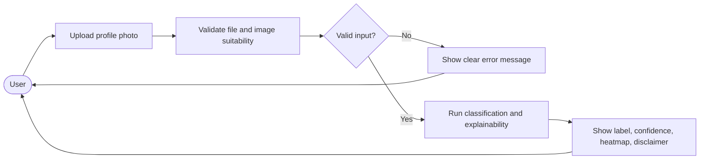

# FaceGuard Product Specification

## 1. Product Summary

FaceGuard is a web-based advisory tool that analyzes a single uploaded face image and estimates whether it is more likely to be a real photograph or an AI-generated synthetic profile photo.

The product is not:

- an identity verification system
- a face recognition system
- a biometric matching platform
- a legal or forensic certification service

## 2. Primary Users

### End users

- People checking suspicious profile photos on social or dating platforms.
- Non-technical users who need a simple explanation, not only a binary label.

### Internal stakeholders

- Project team members building the detector and interface.
- Supervisor and assessors evaluating technical quality, ethics, and feasibility.

## 3. User Value Proposition

Users should be able to:

- upload an image easily
- receive a result quickly
- understand why the system produced that result
- trust that their uploaded image is not being retained

### 3.1 User Interaction Flow

## 4. MVP Scope

### In scope

- Single-image upload for static face images
- Binary classification: `real` vs `ai_generated`
- Confidence score
- Explainability heatmap
- Authentication and login for registered users
- Clear privacy and limitation disclaimer
- Error states for unsupported files and unsuitable images
- Demo deployment

NOTE: Feasibility issue: adding authentication early increases implementation and security burden for MVP.

### Out of scope

- Video or audio deepfake detection
- Face recognition or identity matching
- Persistent per-user result history
- Social platform integrations
- Mobile-native apps
- Multi-tenant or production-scale traffic handling

## 5. Refined Functional Requirements

| ID | Requirement | Priority |
| --- | --- | --- |
| FR1 | The system shall accept image uploads in a limited set of supported formats such as JPG, PNG, and WEBP. | High |
| FR2 | The system shall reject unsupported, corrupted, or oversized files with clear error messages. | High |
| FR3 | The system shall determine whether the image is suitable for analysis, for example whether a clear face is present. | High |
| FR4 | The system shall classify the image as `real` or `ai_generated`. | High |
| FR5 | The system shall return a confidence score with the prediction. | High |
| FR6 | The system shall display an explainability heatmap for the result. | High |
| FR7 | The system shall show upload, processing, success, and failure states in the UI. | High |
| FR8 | The system shall process uploaded images using temporary storage with automatic deletion after processing. | High |
| FR9 | The system shall show a disclaimer that the result is advisory and not proof of identity. | High |
| FR10 | The system shall support local end-to-end execution for development and demonstration. | High |
| FR11 | The project shall evaluate the model on subgroup slices when the dataset supports it. | Medium |
| FR12 | The project shall support replacing the model checkpoint without rewriting the frontend. | Medium |
| FR13 | The application shall provide authentication and login for registered users. | Moderate |

## 6. Non-Functional Requirements

| ID | Requirement | Priority |
| --- | --- | --- |
| NFR1 | Privacy: uploaded images must not be retained in persistent storage for the MVP. | High |
| NFR2 | Security: deployed traffic must use HTTPS. | High |
| NFR3 | Usability: the main upload-to-result flow should be understandable to non-technical users. | High |
| NFR4 | Performance: demo inference should complete fast enough for interactive use on the target deployment. | High |
| NFR5 | Maintainability: frontend, backend, and model code should be separated cleanly. | High |
| NFR6 | Reproducibility: experiments and checkpoints should be traceable to code and configuration. | High |
| NFR7 | Accessibility: result screens should use readable labels, contrast, and status messaging. | Medium |
| NFR8 | Reliability: local and deployed demo environments should behave consistently enough for evaluation. | Medium |
| NFR9 | Availability target for hosted system is 99% uptime. | Moderate |

NOTE: Feasibility issue: strict uptime commitments may be difficult in student-hosted or free-tier deployment environments.

## 7. MVP Acceptance Criteria

The MVP is complete only when all of the following are true:

1. A user can upload a supported image from the browser.
2. The system returns one of:
   - a valid prediction result
   - a clear error state explaining why analysis could not proceed
3. The result includes:
   - label
   - confidence score
   - explainability visualization
   - limitation disclaimer
4. The backend does not persist uploaded images after inference.
5. The end-to-end system runs locally on the team setup.
6. The deployed demo follows the same API contract as local development.
7. The team has a documented evaluation report for the chosen baseline model.
8. The user interface is clear enough for supervisor demonstration without manual explanation of every control.
9. Target model accuracy is `>= 90%`.
10. Target response time is around `2-3 seconds` per analysis request in demo conditions.
11. Target subgroup variance is `<= 5%` where subgroup labels are available.
12. Hosted system target is `>= 99%` uptime.

NOTE: Feasibility issue: hard numeric targets should be treated as planning targets and validated against real dataset quality, compute limits, and hosting constraints.

## 8. Success Metrics

Planned target metrics include hard thresholds:

- overall accuracy `>= 90%`
- response latency around `2-3 seconds`
- subgroup variance `<= 5%`
- hosted availability `>= 99%`

NOTE: Feasibility issue: these thresholds may not hold under all deployment or evaluation conditions and should be monitored as aspirational targets.

In addition to planned hard targets, the team should still report diagnostic metrics:

- balanced accuracy on a held-out test set
- precision, recall, and F1 score
- ROC-AUC if the probability output is reliable
- confusion matrix
- subgroup performance slices if annotations exist
- response latency on the target demo environment

## 9. Result Messaging Rules

The frontend should never imply certainty beyond what the model can justify.

Use wording like:

- "Likely AI-generated"
- "Likely real"
- "Confidence score"
- "Advisory result only"

Avoid wording like:

- "Verified fake"
- "Guaranteed real"
- "Identity confirmed"

## 10. Deferred Features

These were present or implied in the initial planning but should be deferred:

- OAuth or session handling
- analysis history
- feedback submission that stores user uploads
- admin dashboard
- concurrency guarantees beyond demo-level testing

## 11. Product Risks

| Risk | Impact | Mitigation |
| --- | --- | --- |
| Dataset leakage or split contamination | Invalid evaluation results | Use explicit, documented train/val/test split rules |
| Overfitting to dataset-specific artefacts | Poor real-world behavior | Test on held-out generators or alternative samples where possible |
| Misleading confidence values | User overtrust | Calibrate scores and display advisory disclaimer |
| Privacy drift during development | Reputational and ethical issue | Enforce no-upload-retention rule in code and review checklist |
| Scope creep | Delivery delay | Keep the MVP narrow and defer non-essential features |
